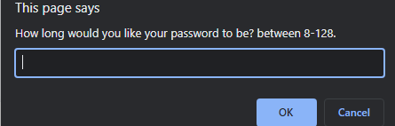
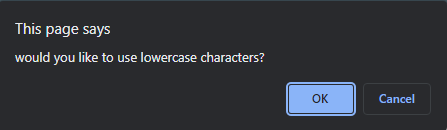
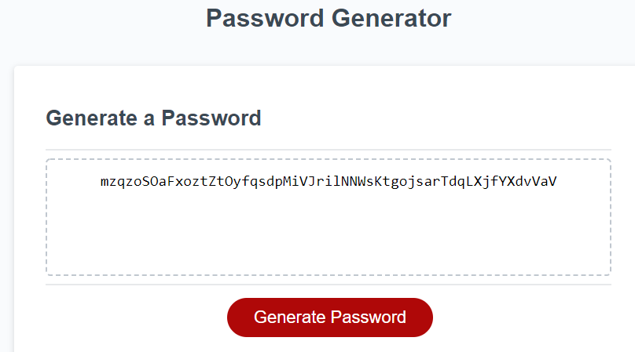

# <em> Password-Gen <em>
#
https://tellez215.github.io/Password-Gen/
## Description 
Hello! This project is called "Password-Gen" and I created this to generate strong passwords for people to use when needed. The page will ask you a couple of questions such as the length you'd want your password to generate, if you want to use lowercase , uppercase, special characters, and finally numbers. Users have the option to choose between these options and it will generate a password base off of the users input options. 

 

## <em>Learning Points
<li> How to create for loops to generate randoms characters. 

<li> The different types of Arthmetic Operators and their use.

<li> Types of Assigment Operators and their functions.

<li> The purpose of using "else , if ."

 

## <em> Visuals

 Webpage asking user for their first input.

 Asking for their second input of lowercase.

 Final Product of users input requests.

 

## <em> License <em>
[MIT] (./License.md)